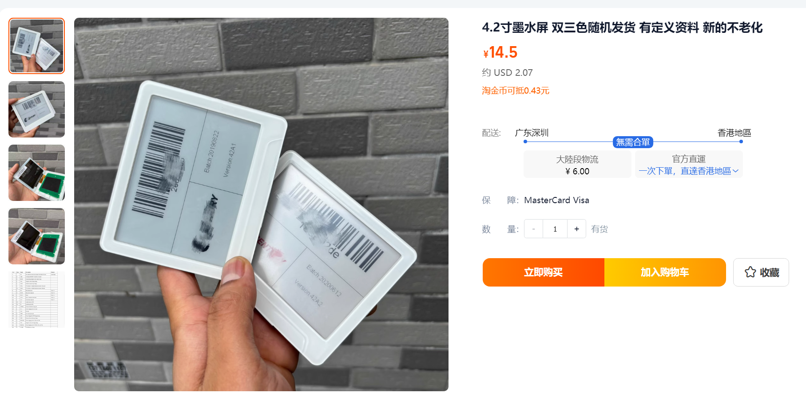
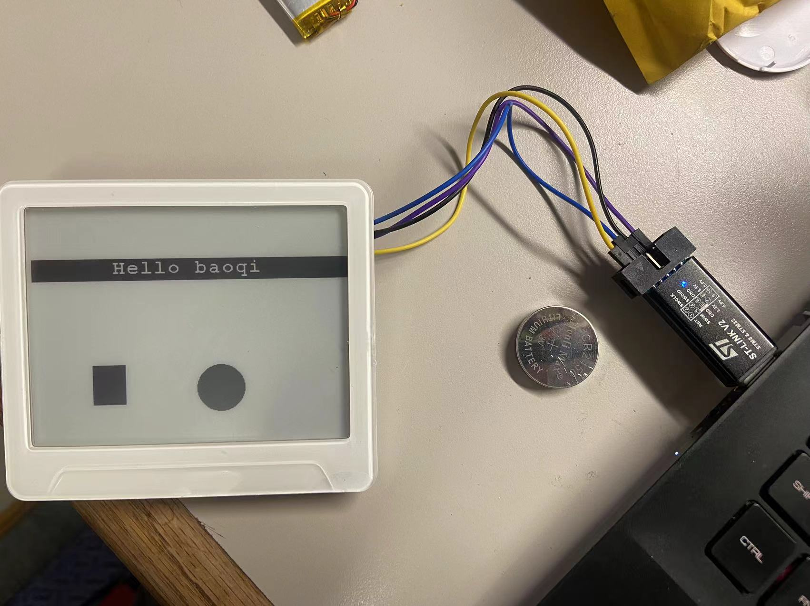
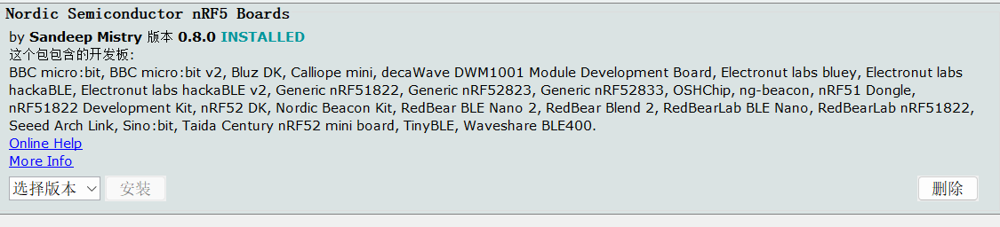
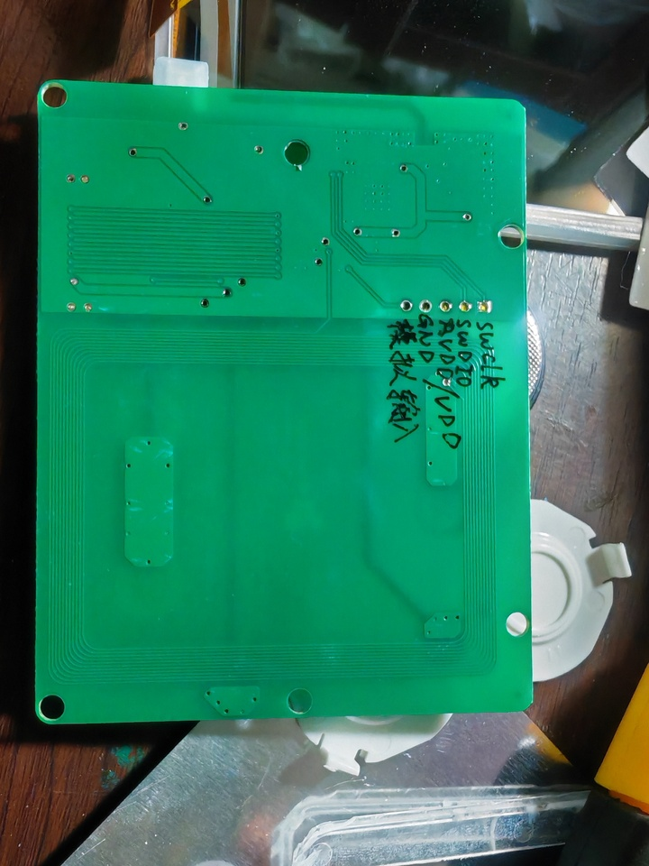
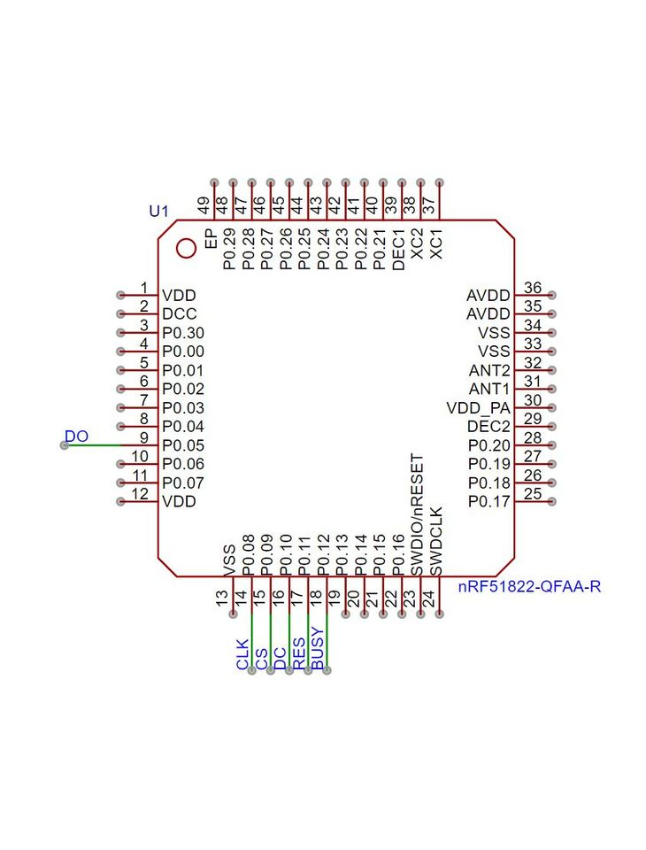

# LaoWu4in2EDP


本代码由 WaveShare 4.2寸墨水屏 Arudion 驱动 (epd4in2b_V2) 移植而来. 适用于 淘宝店 **老五数码之家电子diy元件** 的 **4.2寸墨水屏 双三色随机发货 有定义资料 新的不老化**
可**不拆机**直接用原板原芯片刷屏.

特别感谢淘宝用户 **聆\*\*s** 提供芯片外围电路定义, 淘宝用户 **t\*\*3** 提供烧录口引脚定义, 淘宝用户 **风\*\*谷** 提供驱动版本信息




其他支持资料:
> [微雪官方教程](https://www.waveshare.net/wiki/4.2inch_e-Paper_Module_Manual#Arduino)

## 使用教程
### 材料准备
- 屏幕一块(不用拆机)
- 淘宝盗版 U 盘形状 ST-Link / JLink
- 公对母杜邦线 * 4
- 任意版本 Arduino IDE

### 在 Arduino IDE 中添加 nRF5 系列芯片支持

1. 添加 nRF5 系列芯片支持
在 **文件-首选项-附加开发板管理器网址** 中填入 **https://sandeepmistry.github.io/arduino-nRF5/package_nRF5_boards_index.json**

2. 在 **工具-开发板-开发板管理器** 中搜索 nrf, 安装 **Nordic Semiconductor nRF5 Boards**


3. 切换目标芯片为 nRF5 系列芯片
- 在 **工具-开发板** 中选择 **Nordic Semiconductor nRF5 Boards-Generic nRF51**
- 在 **工具-Chip** 中选择 **16 KB RAM 256KB FLASH**
- 在 **工具-SoftwareDevice** 中选择 **无**
- 在 **工具-LowFrequency Clock** 中选择 **Crystal Oscillator**
- 在 **工具-编程器** 中选择 **ST-Link V2**

### 硬件接线
根据如下接线图把 ST-Link V2 连接到板子, 注意拆开电池就能看到烧录口, 用杜邦线可以直接烧录, 不需要焊线或者拆机.


> 感谢淘宝用户 **t\*\*3** 提供烧录口引脚定义

### 驱动修改
> 感谢淘宝用户 **风\*\*谷** 提供驱动版本信息
> 感谢淘宝用户 **聆\*\*s** 提供芯片外围电路定义

驱动由 WaveShare 4.2寸墨水屏 Arudion 驱动 (epd4in2b_V2) 移植并裁剪而来.
与原版代码 (epd4in2b_V2) 的主要区别是:
- 根据实际外围电路修改引脚定义
- 添加 BS 数据格式切换引脚电平选择

根据如下芯片外围电路定义:

> 注意 13pin 是 BS 引脚,  需要软件拉低.

修改 epdif.h 的引脚定义为
```
// Pin definition
#define RST_PIN         11
#define DC_PIN          10
#define CS_PIN          9
#define BUSY_PIN        12
```

修改 epdif.cpp Line 64, 把 int EpdIf::IfInit(void) 修改为:
```
int EpdIf::IfInit(void) {
    pinMode(CS_PIN, OUTPUT);
    pinMode(RST_PIN, OUTPUT);
    pinMode(DC_PIN, OUTPUT);
    pinMode(BUSY_PIN, INPUT); 
    pinMode(13, OUTPUT);        // ADD
    digitalWrite(13, LOW);      // ADD
    
    SPI.setPins(14, 8, 5);      // ADD
    SPI.begin();
    SPI.beginTransaction(SPISettings(100000, MSBFIRST, SPI_MODE0));
    return 0;
}
```
其中, 13pin 是 BS 引脚, 拉低选择为 SPI 模式. 8, 5 分别是 SPI 的 CLK 和 MOSI, 14 是悬空脚, 设为 MISO, 没有实际用处.

## TroubleShooting
- 出现烧录失败, 请检查 ST-Link 固件版本以及固件到底是 JLink 还是 ST-Link. 使用 JLink 烧录失败请用破解后的 STLinkReflash 刷成 ST-Link.
- 烧录后屏幕反色几次, 但不更新屏幕内容, 请检查 工具-SoftwareDevice 等处的配置, 引脚定义是否修改正确, EpdIf::IfInit 是否修改正确.